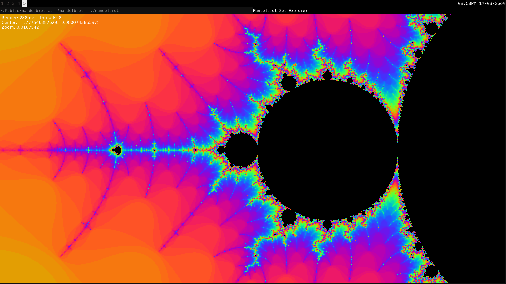
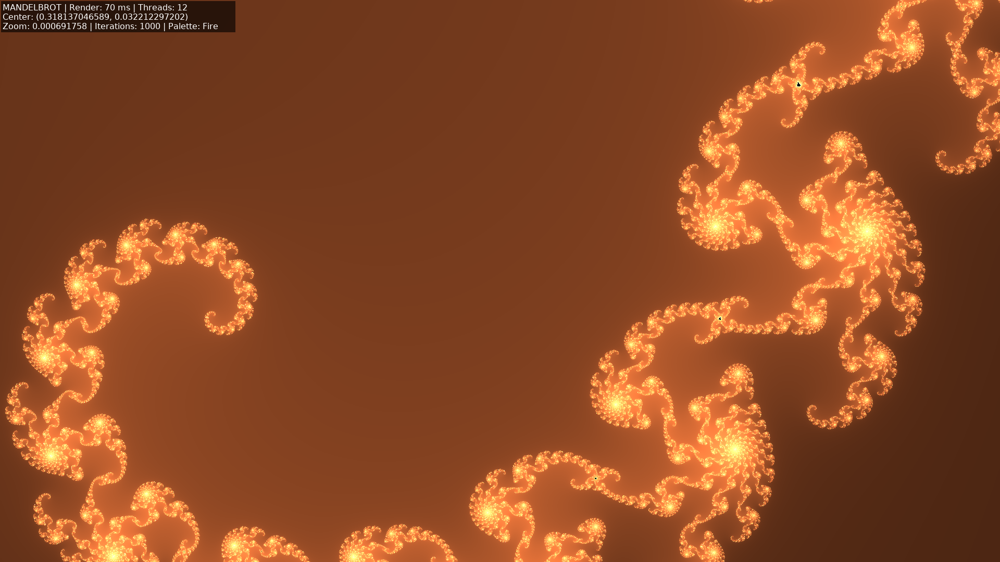
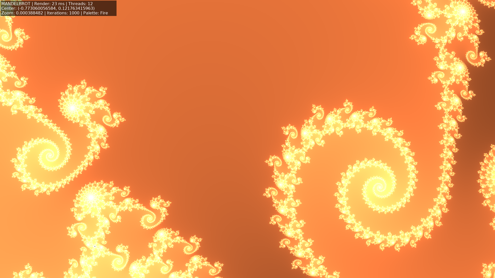
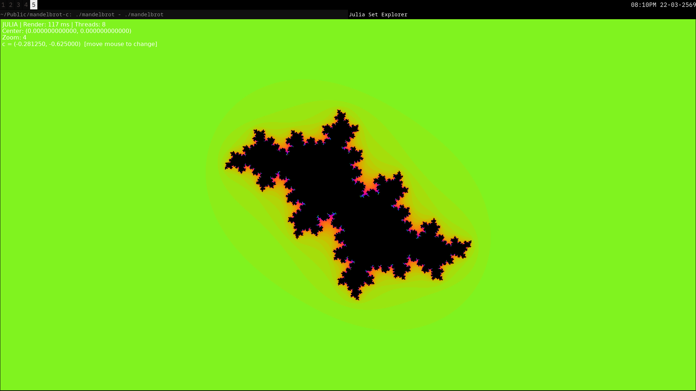
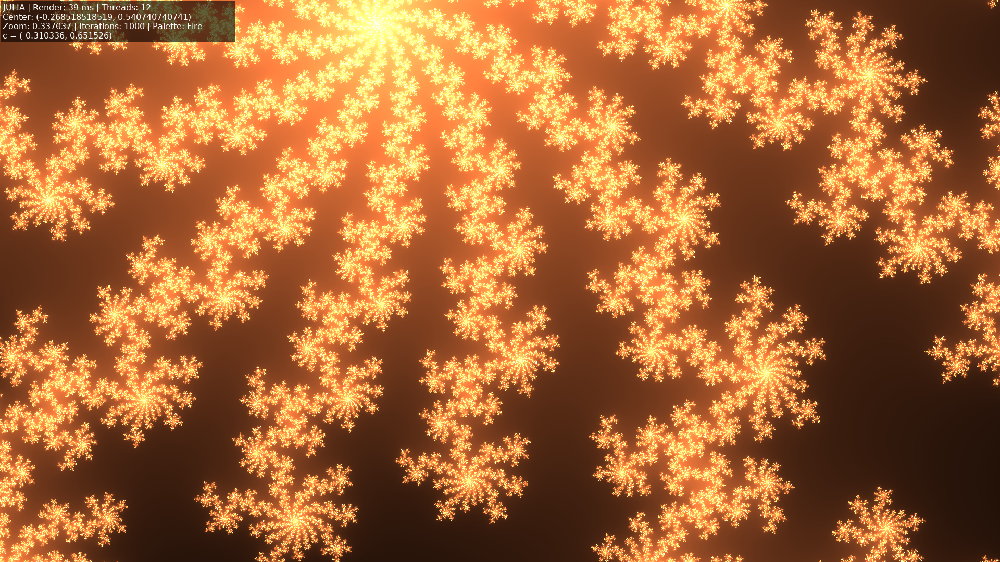
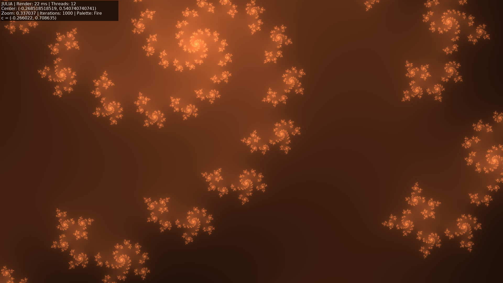

# Mandelbrot-C

[](https://github.com/tiw302/mandelbrot-c/actions)
[](https://opensource.org/licenses/MIT)
[](https://en.wikipedia.org/wiki/C_(programming_language))


A simple, multi-threaded Mandelbrot and Julia set explorer written in C.
This is my attempt to learn low-level graphics and thread management. It is not perfect, but I tried to make it clean and fast.

---

## Table of Contents

- [Introduction](#mandelbrot-c)
- [The Math](#the-math)
- [Features](#features)
- [Prerequisites](#prerequisites)
- [Build & Run](#build--run)
- [Usage](#usage)
- [Configuration](#configuration)
- [Roadmap](#roadmap)
- [Contributing](#contributing)
- [License](#license)

---

Hi! I am currently diving into C programming and wanted to build something visual to understand pointers and memory better. This project is the result of my experiments with SDL2 and pthreads. I hope you find it interesting!

### Mandelbrot





### julia





## The Math

The Mandelbrot set is the set of complex numbers $c$ for which the function $f_c(z) = z^2 + c$ does not diverge when iterated from $z = 0$.

In simple terms:
1. Start with $z = 0$.
2. Calculate the next value: $z_{new} = z_{old}^2 + c$.
3. Repeat. If the magnitude $|z|$ stays small forever, the point $c$ is inside the set (colored black).
4. If $|z|$ explodes (escapes to infinity), the point is outside. The color represents **how fast** it escaped.

### Julia Sets

A Julia set $J_c$ is the closely related fractal you get when you **fix** $c$ and let the starting point $z$ vary across the screen instead. Every single point inside the Mandelbrot set produces a different, connected Julia set. Points near the boundary of the Mandelbrot set produce the most intricate Julia sets -- which is exactly why the interactive mode is so fun to explore.

## Features

- **Real-time Rendering:** Optimized arithmetic for smooth navigation.
- **Multi-threading:** Dynamic workload distribution across available CPU cores.
- **Julia Set Mode:** Press `J` to instantly switch to the Julia set defined by the point under your cursor. Move the mouse to morph the fractal live.
- **Tour Mode:** Press `T` to start an automated "camera tour". In Mandelbrot mode, it zooms into interesting coordinates; in Julia mode, it animates the parameters for you.
- **Screenshot Export:** Press `S` to save the current view as a timestamped PNG -- no extra libraries needed.
- **CPU Powered:** Pure software rendering without GPU acceleration (for educational purposes). [Read more](docs/GPU_INFO.md).
- **Interactive Controls:** Mouse-based panning and zooming.
- **State Management:** Undo history stack for view navigation.
- **Cross-Platform:** Compatible with Linux, macOS, and Windows (via MSYS2).

## Prerequisites

- C Compiler (GCC/Clang/MSVC)
- CMake (version 3.10+)
- SDL2 development libraries
- SDL2_ttf development libraries
- zlib (almost always pre-installed; required for PNG screenshot export)

### Installation

**Debian / Ubuntu**
```bash
sudo apt install libsdl2-dev libsdl2-ttf-dev
```

**Arch Linux**
```bash
sudo pacman -S sdl2 sdl2_ttf
```

**Fedora**
```bash
sudo dnf install SDL2-devel SDL2_ttf-devel
```

**Void Linux**
```bash
sudo xbps-install -S SDL2-devel SDL2_ttf-devel
```

**macOS**
```bash
brew install sdl2 sdl2_ttf
```

**Windows (MSYS2)**
```bash
pacman -S mingw-w64-x86_64-SDL2 mingw-w64-x86_64-SDL2_ttf
```

## Build & Run

The project uses CMake for cross-platform compilation.

> **Friendly tip:** If you run into build errors, please double-check that you have the [Prerequisites](#prerequisites) installed!

```bash
# Configure the build
cmake -S . -B build -DCMAKE_BUILD_TYPE=Release

# Build the application
cmake --build build

# Run the executable
./build/mandelbrot
```

## Usage

| Action | Control |
|--------|---------|
| **Zoom In** | Left Mouse Drag |
| **Pan** | Right Mouse Drag |
| **Undo Zoom** | `Ctrl` + `Z` |
| **Iterations** | `Up` / `Down` (Shift for x10) |
| **Palettes** | `P` |
| **Reset View** | `R` |
| **Toggle Julia Mode** | `J` |
| **Save Screenshot** | `S` |
| **Tour Mode** | `T` |
| **Quit** | `Esc` or `Q` |

### Julia Mode

Press `J` while hovering over any point on the Mandelbrot set to jump into Julia mode.
The complex coordinate under your cursor becomes the parameter $c$ that defines the Julia set.
Move your mouse around to morph the fractal in real time -- every position gives you a completely different shape.
Press `J` again to return to the exact Mandelbrot view you left.

### Tour Mode

Press `T` to toggle the automated exploration mode:

- **In Mandelbrot Mode:** The camera will automatically pan and zoom into a series of hand-picked, visually complex regions (the "Seahorse Valley," "Elephant Valley," etc.).
- **In Julia Mode:** The $c$ parameter will smoothly glide between interesting sets, showcasing spirals, dendrites, and Siegel disks without any mouse input.

### Screenshots

Press `S` at any time to export the current frame as a PNG.
Files are saved in the working directory with a timestamp in the filename, e.g. `mandelbrot_20250315_142031.png`.
The encoder is built on zlib with no extra dependencies.

## Configuration

Rendering parameters can be tuned in `include/config.h` to balance performance and visual fidelity:

- `DEFAULT_ITERATIONS`: Controls the initial detail level.
- `MAX_ITERATIONS_LIMIT`: Upper bound for runtime adjustments.
- `THREAD_COUNT`: Number of parallel threads (set to match CPU cores).
- `ESCAPE_RADIUS`: Mathematical threshold for the set calculation.

## Roadmap

### Performance Optimization
- [x] Implement dynamic load balancing using a work queue or tiled rendering to improve CPU utilization across cores.
- [x] Replace real-time trigonometric color calculations with a pre-calculated Look-Up Table (LUT).
- [x] Implement smooth coloring algorithms using fractional iteration counts.
- [x] Explore SIMD (AVX/AVX2) vectorization to process multiple pixels per instruction.

### Features and Exploration
- [x] Add interactive controls to adjust maximum iterations and switch color palettes during runtime.
- [x] Implement an automated "camera path" or "tour" mode for smooth zooming animations.
- [ ] Research and implement high-precision arithmetic for deep zooms (See [RESEARCH.md](RESEARCH.md)).

### Advanced Backends (Experimental)
Future backend developments (GPU, WebAssembly) are currently being tracked and researched in separate branches. For more information on the architectural strategy, please refer to [RESEARCH.md](RESEARCH.md).

### Engineering Improvements
- [x] Migrate the build system from Makefile to CMake for better cross-platform support.
- [ ] Add unit tests for core mathematical functions.
- [ ] Implement automatic CPU core detection to dynamically set the thread count.

## Contributing

I am still learning, so if you spot any bugs or have suggestions for improvements (especially around memory safety!), I would really appreciate your help. Feel free to open an issue or pull request. Thank you!

## License

This project is licensed under the [MIT License](LICENSE) - see the [LICENSE](LICENSE) file for details.
