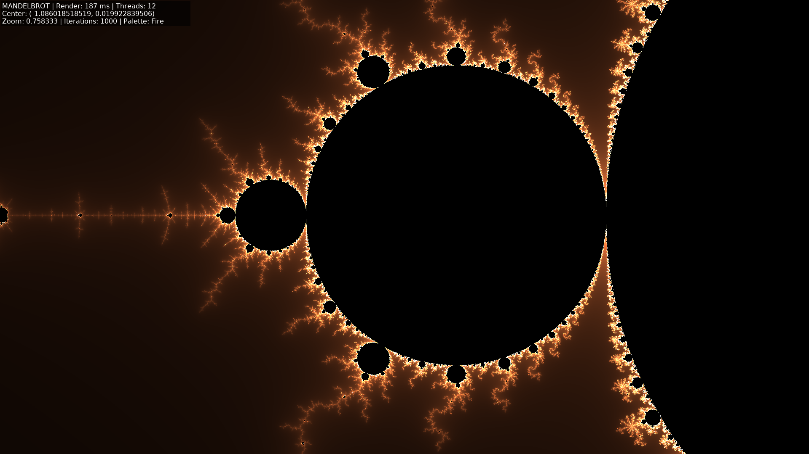
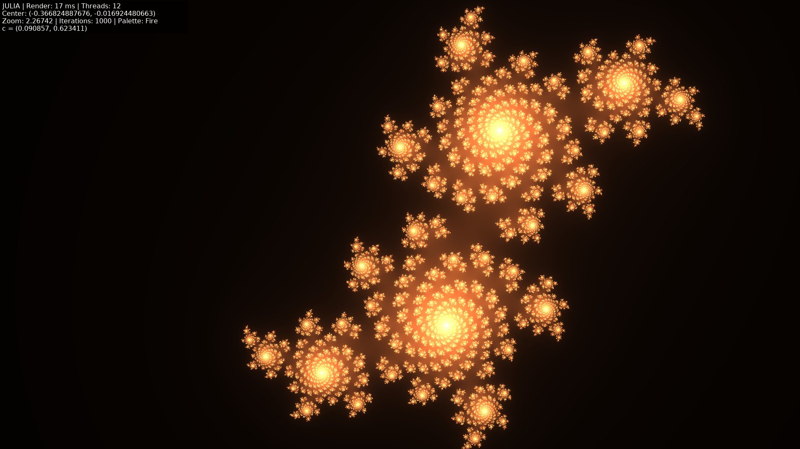

# Mandelbrot-C

[](https://github.com/tiw302/mandelbrot-c/actions)
[](https://opensource.org/licenses/MIT)
[](https://en.wikipedia.org/wiki/C11_(C_standard_revision))


A high-performance, multi-threaded Mandelbrot and Julia set explorer written in C11. This project utilizes an Engine-Centric Architecture targeting Native Desktop (CPU/AVX2), Web (WebAssembly/SIMD128), and hardware-accelerated GPU rendering (WebGL/Sokol GFX).

Live Web Demo: **[tiw302.github.io/mandelbrot-c/](https://tiw302.github.io/mandelbrot-c/)**

---

## Table of Contents

| **Overview & UX** | **Engineering & Math** | **Dev & Ops** | **Project Lifecycle** |
| :--- | :--- | :--- | :--- |
| • [Introduction](#introduction) | • [The Mathematics](#the-mathematics) | • [Build & Installation](#build-and-installation) | • [Roadmap](#roadmap) |
| • [Technical Preview](#technical-preview) | • [Technical Architecture](#technical-architecture) | • [Configuration](#configuration) | • [Contributing](#contributing) |
| • [Core Features](#core-features) | • [Platform Implementations](#platform-implementations) | • [Project Structure](#project-structure) | • [License](#license) |
| • [Interactive Controls](#interactive-controls) | | | |

---

## Introduction

Mandelbrot-C is an exploratory project focused on the intersection of low-level C programming and high-performance graphics. This journey began as a deep dive into C11 to understand pointers, memory management, and hardware acceleration. What started as a simple SDL2 experiment has evolved into a production-grade fractal engine.

Throughout the development process, I have explored advanced topics including SIMD intrinsics, multi-threaded load balancing, WebAssembly porting, and shader-based 64-bit precision emulation.

---

## Technical Preview

### Mandelbrot Explorer


### Julia Set Exploration


---

## Core Features

- **Hybrid Rendering Pipeline:** Choice between optimized multi-threaded CPU rendering or hardware-accelerated GPU rendering.
- **WASM Performance:** Desktop-class performance in the browser via WebAssembly, SIMD128, and multi-threaded Web Workers.
- **Persistent State Sharing:** Share mathematical discoveries via URL parameters that track coordinates, zoom, iterations, and color palettes.
- **Hi-Lo Precision GPU Math:** 64-bit precision emulation in GLSL shaders for deep-zoom exploration.
- **Interactive Tour Mode:** Automated exploration paths for both Mandelbrot and Julia sets.
- **Professional Screenshot System:** Deferred capture logic that ensures high-fidelity PNG exports by synchronizing with the GPU rendering cycle.
- **Dynamic HUD:** A redesigned, responsive Heads-Up Display showing 14-decimal precision coordinates.

---

## Interactive Controls

| Action | Desktop Key | Web Key | Web UI / Touch |
| :--- | :--- | :--- | :--- |
| **Zoom In** | Left-Drag (Box) | Left-Drag (Box) | Pinch-In |
| **Pan** | Right-Drag | Right-Drag | Two-Finger Drag |
| **Undo** | `Ctrl + Z` | `Ctrl + Z` | "Undo" Button |
| **Screenshot** | `S` | `S` | "Screenshot" Button |
| **Tour Mode** | `T` | `T` | "Tour" Button |
| **GPU/CPU Toggle** | `G` | `G` | "GPU" Button |
| **Julia Toggle** | `J` | `J` | "Julia" Button |
| **Palette Cycle** | `P` | `P` | "Palette" Button |
| **Iterations** | `Up/Down` | `Up/Down` | `Iter+/Iter-` |
| **Reset View** | `R` | `R` | "Reset" Button |
| **Copy Link** | - | - | "Copy Link" Button |
| **Quit** | `Esc` / `Q` | - | - |

---

## The Mathematics

The Mandelbrot set is defined as the set of complex numbers $c$ for which the function $f_c(z) = z^2 + c$ remains bounded when iterated from $z = 0$.

### Optimization Strategies
To maintain high frame rates in dense regions, the engine implements several mathematical optimizations:
- **Main Cardioid Rejection:** Points inside the main cardioid are detected using a vectorized check to skip expensive iterations.
- **Period-2 Bulb Check:** Similar to the cardioid, points within the largest circular bulb are filtered out early.
- **Normalized Iteration Count:** Prevents color banding by using a fractional iteration formula, resulting in smooth gradients.

---

## Technical Architecture

### Engine-Centric Design
The codebase strictly adheres to a modular architecture to ensure Separation of Concerns (SoC):
- **Core [SSOT]:** Pure mathematical definitions (`mandelbrot.c`, `julia.c`) are the Single Source of Truth, agnostic to rendering APIs.
- **Engine Layer:** Manages high-level rendering logic, thread-pools, and platform-agnostic graphics abstractions (via Sokol GFX).
- **Application Layer:** Platform-specific entry points (SDL2 for Desktop, Emscripten for Web) handle input and OS-level interactions.

### WebAssembly Subsystem
The WASM implementation utilizes `SharedArrayBuffer` to enable real multi-threading in the browser. The built-in `server.py` is configured to handle the required COOP/COEP security headers for local development.

---

## Platform Implementations

### CPU Rendering (Native Desktop)
The native CPU engine is designed for maximum throughput on multi-core systems:
- **Dynamic Load Balancing:** Instead of static partitioning, the engine uses an **Atomic Row Counter**. Threads dynamically "claim" the next available row of pixels, ensuring that no CPU core sits idle while others are stuck rendering dense "black" regions of the fractal.
- **AVX2 Vectorization:** Utilizing 256-bit YMM registers, the engine processes **4 double-precision complex numbers** in a single instruction cycle (SIMD). This provides a theoretical 4x performance boost over scalar C code.
- **Persistent Thread Pool:** To avoid OS overhead, threads are spawned once at startup and managed via condition variables, ready to render new frames instantly as the user navigates.

### Web Rendering (WebAssembly & WASM-SIMD)
Bringing desktop-class performance to the browser required solving several engineering challenges:
- **Multithreading via Web Workers:** By leveraging Emscripten's pthreads support, the C engine runs across multiple Web Workers. These workers communicate via a **SharedArrayBuffer**, allowing them to share the same pixel memory space as the main thread.
- **WASM-SIMD128:** We utilize the modern WebAssembly SIMD proposal (128-bit) to process **2 double-precision points** simultaneously, bridging the gap between browser and native performance.
- **Security & Headers:** To enable `SharedArrayBuffer`, the environment must be "Cross-Origin Isolated." We implemented a specialized **Service Worker** (`coi-serviceworker.js`) to automatically inject COOP and COEP headers, ensuring the engine runs on standard static hosting without server-side configuration.

### GPU Rendering (WebGL & Hi-Lo Precision)
The GPU path offloads all calculations to the graphics card for real-time smoothness:
- **Hi-Lo Double Precision Emulation:** Standard GPUs (especially on web/mobile) only support 32-bit floats, which causes pixelation at high zoom. Our custom GLSL shader splits each 64-bit coordinate into two 32-bit "High" and "Low" parts, performing **extended precision arithmetic** manually within the shader.
- **Sokol GFX Integration:** We use the Sokol GFX library as a lightweight abstraction layer, allowing the same shader code and pipeline logic to run seamlessly on both Native OpenGL (Desktop) and WebGL 2.0 (Browser).
- **Deferred Readback:** Screenshots in GPU mode utilize a "Deferred Capture" system, ensuring the pixel data is read back from the GPU memory only after the frame is fully validated.

---

## Build and Installation

### Interactive TUI Build (Recommended)
Run the following for a user-friendly terminal menu:
```bash
./build.sh
```

### Manual Build
```bash
# Desktop (CPU)
cmake -S . -B build -DBUILD_CPU=ON
cmake --build build

# Web (WASM)
emcmake cmake -S . -B build-web -DBUILD_WEB=ON
cmake --build build-web
```

---

## Configuration

Rendering parameters can be tuned in `include/config.h`:
- `DEFAULT_ITERATIONS`: Initial detail level.
- `MAX_ITERATIONS_LIMIT`: Upper bound for runtime adjustments.
- `DEFAULT_THREAD_COUNT`: Number of parallel threads (0 = auto-detect).
- `ESCAPE_RADIUS`: Mathematical threshold for divergence.

---

## Project Structure

```text
.
├── include/             # Global configuration and platform headers
├── src/
│   ├── core/           # Pure Mathematical Engine (Single Source of Truth)
│   ├── engine/         # Platform-Agnostic Renderers, Tours, and Logic
│   └── app/            # Platform-Specific Entries (Desktop, Web)
├── web/                 # Web Frontend (HTML, CSS, JS)
├── assets/              # Shared Typography and Media
├── tests/               # Automated Unit Testing Suite
├── third_party/         # External Abstractions (Sokol, stb, etc.)
├── CMakeLists.txt       # Unified Cross-platform Build System
└── build.sh             # Interactive TUI Build Wrapper
```

---

## Roadmap

### Performance Optimization
- [x] Implement dynamic load balancing using atomic row-counters to maximize CPU utilization.
- [x] Integrate a pre-calculated Look-Up Table (LUT) for color mapping.
- [x] Implement smooth coloring algorithms using fractional iteration counts.
- [x] Deploy hardware-specific vectorization (AVX2 for Desktop, SIMD128 for WebAssembly).
- [x] Research and implement pure-shader fractal calculation for GPU rendering.
- [x] Optimize Julia set calculation using hardware-specific vectorization.

### Features and Exploration
- [x] Add interactive runtime controls for iteration depth and palette switching.
- [x] Implement automated "camera path" and "tour" modes.
- [x] Connect HTML5 Frontend APIs to the web-engine for a responsive experience.
- [x] Implement URL-based state recovery and deep-linking for sharing discoveries.
- [x] Add mobile touch support (pinch-to-zoom and gesture-based panning).

### Engineering and Quality
- [x] Establish a strict Engine-Centric Monorepo architecture.
- [x] Implement a high-performance CMake build system.
- [x] Expand unit testing coverage to ensure mathematical consistency.
- [x] Implement automatic CPU core detection for dynamic thread pool allocation.
- [x] Implement Hi-Lo 64-bit precision emulation for GPU shaders.
- [ ] Research and implement arbitrary-precision arithmetic for infinite zoom.

---

## Contributing

I am still a learner in the vast world of C programming and high-performance computing. If you spot any bugs, identify memory safety concerns, or have suggestions for improving SIMD and GPGPU optimizations, I would be deeply grateful for your guidance. Every piece of advice, feedback, or architectural suggestion is a valuable lesson for me.

If you would like to help:
1. Feel free to open an **issue** to discuss bugs or improvements.
2. If you'd like to contribute code, please **fork** the repository and open a **pull request**.
3. Descriptive commit messages and clear explanations are highly appreciated.

Thank you for being a part of my learning journey and for helping make this project better!

---

## License

This project is licensed under the [MIT License](LICENSE) - see the [LICENSE](LICENSE) file for details.
